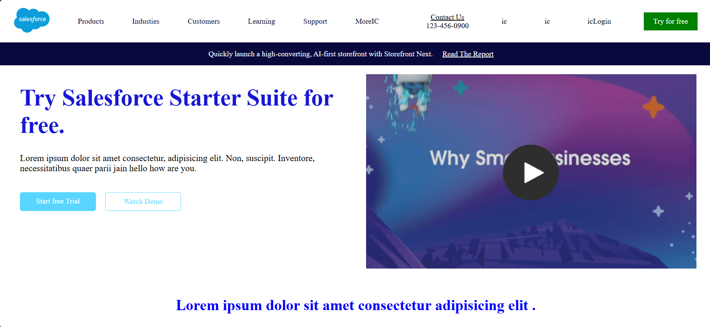

# 🚀 Salesforce Clone

A responsive **Salesforce Landing Page Clone** built using **HTML5** and **CSS3**. This project recreates the modern Salesforce homepage with a clean layout, responsive design, and visually appealing UI components.

---

## 📸 Preview

### Home Page



### Features Section


---

## ✨ Features

- 🎨 Modern and clean user interface
- 📱 Fully responsive design
- 🖥️ Hero section with call-to-action
- 📑 Navigation bar with menu items
- 📦 Multiple content sections
- 🖼️ Images and icons integration
- ⚡ Smooth layout using Flexbox & CSS
- 🌐 Cross-browser compatible

---

## 🛠️ Tech Stack

- HTML5
- CSS3

---

## 📂 Project Structure

```text
salesforce-clone/
│── assets/
│   ├── images/
│── index.html
│── style.css
└── README.md
```

---

## 🚀 Getting Started

### 1. Clone the repository

```bash
git clone https://github.com/parijainpari76-dotcom/salesforce-clone.git
```

### 2. Navigate to the project folder

```bash
cd salesforce-clone
```

### 3. Run the project

Open `index.html` in your preferred web browser.

---

## 🎯 Learning Outcomes

This project helped me practice:

- Semantic HTML5
- CSS3 Styling
- Flexbox Layout
- Responsive Web Design
- UI Cloning
- Project Structure
- Frontend Development Best Practices

---

## 📌 Future Improvements

- Add JavaScript for interactive elements
- Mobile navigation menu
- Smooth animations and transitions
- Dark mode support
- Performance optimization

---

## 👩‍💻 Author

**Pari Jain**

- GitHub: https://github.com/parijainpari76-dotcom

---

## ⭐ Support

If you found this project useful, consider giving it a ⭐ on GitHub!